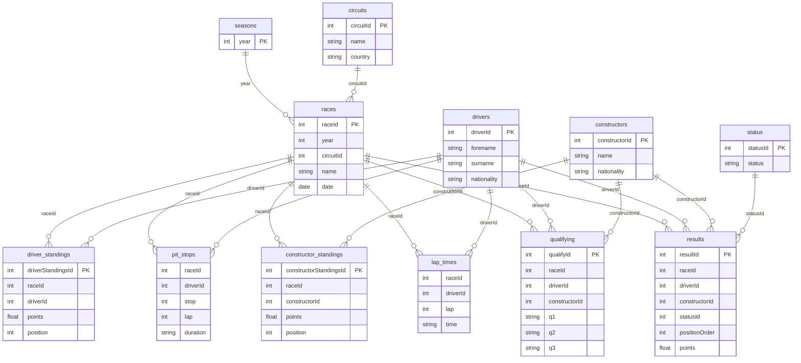

# f1-analysis
The Formula 1 Analysis (1950-2024)
I was intrigued by one of my favorite sports, so I decided to gather statistics and analyze the Queen of Motorsports.

```mermaid
erDiagram
    seasons {
        int year PK
    }
    circuits {
        int circuitId PK
        string name
        string country
    }
    races {
        int raceId PK
        int year
        int circuitId
        string name
        date date
    }
    drivers {
        int driverId PK
        string forename
        string surname
        string nationality
    }
    constructors {
        int constructorId PK
        string name
        string nationality
    }
    status {
        int statusId PK
        string status
    }
    results {
        int resultId PK
        int raceId
        int driverId
        int constructorId
        int statusId
        int positionOrder
        float points
    }
    qualifying {
        int qualifyId PK
        int raceId
        int driverId
        int constructorId
        string q1
        string q2
        string q3
    }
    lap_times {
        int raceId
        int driverId
        int lap
        string time
    }
    pit_stops {
        int raceId
        int driverId
        int stop
        int lap
        string duration
    }
    driver_standings {
        int driverStandingsId PK
        int raceId
        int driverId
        float points
        int position
    }
    constructor_standings {
        int constructorStandingsId PK
        int raceId
        int constructorId
        float points
        int position
    }

    seasons ||--o{ races : "year"
    circuits ||--o{ races : "circuitId"
    races ||--o{ results : "raceId"
    races ||--o{ qualifying : "raceId"
    races ||--o{ lap_times : "raceId"
    races ||--o{ pit_stops : "raceId"
    races ||--o{ driver_standings : "raceId"
    races ||--o{ constructor_standings : "raceId"
    drivers ||--o{ results : "driverId"
    drivers ||--o{ qualifying : "driverId"
    drivers ||--o{ lap_times : "driverId"
    drivers ||--o{ pit_stops : "driverId"
    drivers ||--o{ driver_standings : "driverId"
    constructors ||--o{ results : "constructorId"
    constructors ||--o{ qualifying : "constructorId"
    constructors ||--o{ constructor_standings : "constructorId"
    status ||--o{ results : "statusId"
```
