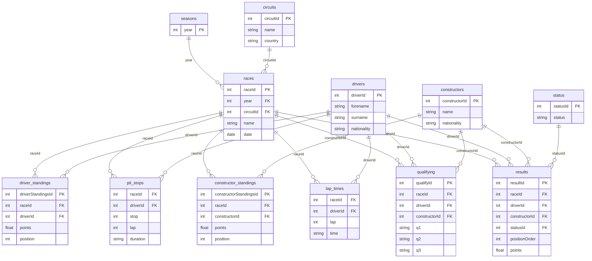

# f1-analysis

**The Formula 1 Analysis (1950–2024).** I was intrigued by one of my
favorite sports, so I decided to gather statistics and analyze the
Queen of Motorsports.

A portfolio analysis of the full Ergast / Kaggle F1 dataset across
**nine themed notebooks** and **nine F1 technical eras**. The work
covers driver careers and milestones, team dynasties, championship
storylines, circuits, nationalities, pit-stop strategy, and per-era
trends — about 90 numbered analytical questions in total.

## Data schema

The dataset is a relational set of 14 CSVs (drivers, races, results,
qualifying, lap times, pit stops, standings, …). The diagram below
shows the primary/foreign-key relationships between the core tables.
The same diagram lives in [`data/ER-d.md`](data/ER-d.md), and
[`data/README.md`](data/README.md) links to the original Kaggle source.



## What's in this repo

| # | Notebook | What it covers |
|---|---|---|
| 1 | [`Race Performance.ipynb`](Race%20Performance.ipynb) | Driver race results — wins, podiums, poles, streaks, perfect weekends, win rate by starting grid, race-end status mix |
| 2 | [`Driver Career and Milestones.ipynb`](Driver%20Career%20and%20Milestones.ipynb) | Career-volume records, milestones never reached, youngest/oldest at pole/podium/win, debut-season heroics, shared-surname families |
| 3 | [`Championship Storylines.ipynb`](Championship%20Storylines.ipynb) | Narrative arcs — wire-to-wire leaders, late-season swings, champion DNFs in finales |
| 4 | [`Teams.ipynb`](Teams.ipynb) | Constructor analysis — top teams, longest streaks, biggest year-over-year jumps, competitive teammate pairs, constructors per nationality |
| 5 | [`Seasons.ipynb`](Seasons.ipynb) | Season-level metrics — championship gaps, distinct winners per season, era competitiveness, season start/end/length, finishers and grid size, sprint races over time |
| 6 | [`Statistics for each Era.ipynb`](Statistics%20for%20each%20Era.ipynb) | The 9-era reference table + per-era driver/team breakdowns and a cross-era scatterplot |
| 7 | [`Circuits.ipynb`](Circuits.ipynb) | Venue analysis — most-raced, most dangerous, overtakes per race, house circuits, median race time, lap-time evolution at top 10 circuits |
| 8 | [`Countries and Nationalities.ipynb`](Countries%20and%20Nationalities.ipynb) | Nationality breakdowns — driver entries, podiums/wins/titles by country, nationality inside top-10 teams |
| 9 | [`Pit Stops and Strategy.ipynb`](Pit%20Stops%20and%20Strategy.ipynb) | Pit-stop data (2011–2024) — stops per race, fastest/slowest stops, per-circuit pit times |

The full numbered backlog of analytical questions lives in [`QuestionsF1.txt`](QuestionsF1.txt).

## How to run

1. Download the dataset from [Kaggle: Formula 1 World Championship (1950–2024)](https://www.kaggle.com/datasets/rohanrao/formula-1-world-championship-1950-2020).
2. Unzip into an `excel/` folder at the repo root. You should end up with
   `excel/drivers.csv`, `excel/results.csv`, `excel/races.csv`, etc.
3. Install dependencies and launch Jupyter:
   ```bash
   pip install -r requirements.txt
   jupyter lab
   ```
4. Open any notebook and run all cells.

Each notebook is **self-contained** — it loads CSVs, strips Indianapolis 500
entries (see *Conventions* below), and saves charts into `charts/`. Run them
in any order. Section 6 (*Statistics for each Era*) builds the `eras_df`
reference used elsewhere; the other notebooks rebuild it locally as needed.

## Data source

Data: Kaggle dataset [Formula 1 World Championship (1950–2024)](https://www.kaggle.com/datasets/rohanrao/formula-1-world-championship-1950-2020)
by rohanrao — a snapshot of the [Ergast Developer API](http://ergast.com/mrd/).

The CSVs are not redistributed in this repo (see *How to run* for the download
step). The expected files after unzipping into `excel/` are: `drivers.csv`,
`results.csv`, `races.csv`, `constructors.csv`, `circuits.csv`, `qualifying.csv`,
`driver_standings.csv`, `constructor_standings.csv`, `constructor_results.csv`,
`lap_times.csv`, `pit_stops.csv`, `sprint_results.csv`, `seasons.csv`,
`status.csv`.

The CSV data is © Ergast and subject to its own terms.

## Conventions

These choices are applied consistently across every notebook:

- **Indy 500 exclusion.** The Indianapolis 500 was nominally part of the F1
  World Championship from **1950 to 1960** but was a separate American oval
  race. Most "F1 drivers" in those rows never raced anywhere else in F1, so
  Indy 500 entries are stripped at the top of every notebook before any
  statistic is computed.
- **Points normalization.** Raw championship points are not comparable across
  eras (a win was worth 8 points in 1950, 25 today). The headline number is
  **% of season-max points** — what fraction of the *theoretically* maximum
  points a driver actually scored. Raw points appear as a footnote/secondary
  view, and **wins** are added as a third lens.
- **Era framing.** The project uses 9 technical eras (defined in
  *Statistics for each Era.ipynb*) — Front-engine, Rear-engine,
  Cosworth-DFV, Turbo, V12/V10, Refuel-V10, Refuel-V8, V8 (no refuel),
  Hybrid V6. Charts are colored by era rather than by decade.
- **Chart filename convention.** `charts/<section>.<question>_<slug>.png`,
  e.g. `2.9_never_won.png`. Section numbers match the table above and
  `QuestionsF1.txt`.

## Headline insights

1. **Win-rate concentration is high in every era.** In any given era, 1–2
   drivers sit far above the rest (Fangio ~47% in Era 1, Schumacher ~40% in
   Era 7, Hamilton/Verstappen ~30%+ in Era 9). The "competitive midfield"
   narrative is real, but the *top* of the grid is just as dominated as ever.
2. **Schumacher's 2002 season is statistically unmatched** — 11 wins of 17
   races (65%). Highest single-season win rate in the modern era.
3. **The most "open" era was Era 3 (1968–1982)** — 11 different World
   Champions in 15 seasons. No other era comes close to that diversity.
4. **Of 861 F1 drivers, only ~14% ever won a race.** Winning is rare even at
   this level.
5. **The "youngest race winner" is younger than the "youngest pole sitter."**
   Verstappen won at 18y 7m (Spain 2016); Vettel set the youngest pole at
   21y 2m (Italy 2008). Wins can come from inheritance (strategy, attrition);
   poles require a single perfect lap.
6. **Only 1 driver since 1961 has won their debut race** — Giancarlo Baghetti
   at France 1961.
7. **Fangio's 5 titles for 4 different constructors** (Alfa Romeo, Maserati,
   Mercedes, Ferrari) is unmatched. Modern champions stick with one team
   for their title runs.

## What's next

- **Power BI dashboard** — turn the strongest insights into an interactive
  dashboard with year/era filters and driver/team drill-downs.
- **Cross-era trend charts** — single-image views of how F1 has changed
  (champion ages, constructor diversity, win-rate concentration).
- **Deferred Section 6 questions** — rule-change impact, points distribution
  normalization (see `QuestionsF1.txt` 6.3–6.6).

## Repo layout

```
f1-analysis/
├── Race Performance.ipynb               # 1 — driver race results
├── Driver Career and Milestones.ipynb   # 2 — career & milestone records
├── Championship Storylines.ipynb        # 3 — narrative arcs
├── Teams.ipynb                          # 4 — constructors
├── Seasons.ipynb                        # 5 — season-level metrics
├── Statistics for each Era.ipynb        # 6 — per-era analysis (defines eras_df)
├── Circuits.ipynb                       # 7 — venues
├── Countries and Nationalities.ipynb    # 8 — driver nationalities
├── Pit Stops and Strategy.ipynb         # 9 — pit data (2011–2024)
├── QuestionsF1.txt                      # canonical numbered question backlog
├── README.md                            # this file
├── LICENSE
├── requirements.txt
├── f1_utils.py                          # shared plumbing (CSV loader, Indy cleanup, eras_df)
├── explore_csvs.py                      # CSV inspector helper
├── data/                                # schema documentation
│   ├── ER-d.md                          # entity-relationship diagram (Mermaid)
│   └── README.md                        # Kaggle source link
├── excel/                               # Ergast CSVs — gitignored, see "How to run"
└── charts/                              # auto-generated PNG exports
    ├── 2.0_funnel.png                   # filename = <section>.<question>_<slug>.png
    ├── 2.9_never_won.png
    ├── 6.0_eras_timeline.png
    ├── 6.1_era1_top_drivers.png         # 6.1 = best driver per era
    ├── 6.2_era1_wins_per_team.png       # 6.2 = best team per era
    └── … etc.
```

## Tech stack

`pandas` · `matplotlib` · `seaborn` · `sqlite3` · Jupyter

## License

Released under the [MIT License](LICENSE).
